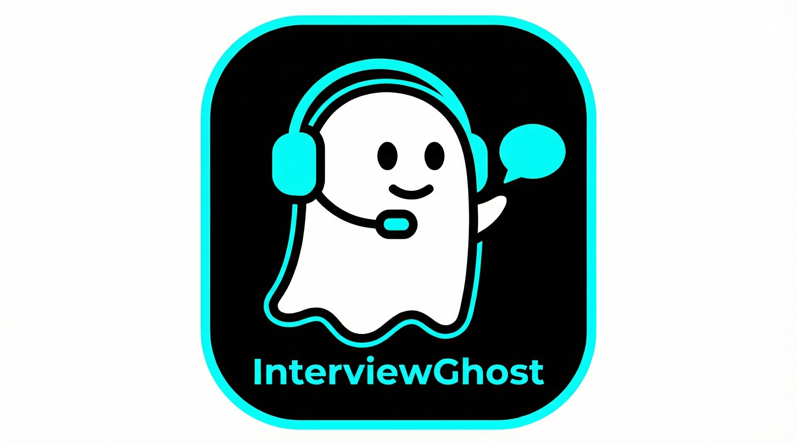

# InterviewGhost 👻

<p align="center">
  
</p>

**The Open-Source Interview Assistant: Real-time transcription, RAG-powered prompts, and a second-screen UI.**

InterviewGhost is a **free**, desktop agent + phone UI that provides instant "contextual reminders" during calls. Unlike expensive paid alternatives, it stays **on your phone**, keeping your desktop clean and your focus sharp.

**Built in one evening to prove that you don't need a $10M seed round to help candidates level the playing field.**

---

## Video demo (Vision Model)
Demo shows the vision model analyzing an algorithmic problem statement and generating a structured approach (key idea, steps, complexity), not just a raw answer.
▶️ **Watch:** [](https://youtu.be/Jhi_P9DzIt0)

---

## ✨ Features
- **Dual-audio recording**: High-quality capture of both your mic and system audio (WASAPI).
- **RAG (Retrieval-Augmented Generation)**: Drop your CV, notes, or documentation into the `rag/` folder. The AI will prioritize *your* facts over generic hallucinations.
- **Vision Model Support**: Analyze technical tasks or diagrams via screenshots.
- **Phone-Based UI**: A sleek web-app accessible via QR code on your local Wi-Fi.

---

## 📱 Second-screen UI (clean desktop by design)
Many tools try to add desktop overlays. InterviewGhost takes a simpler approach: the UI lives on your phone.

- **No desktop overlay:** nothing is drawn over your screen.
- **Phone companion:** scan a QR code and use a lightweight web UI on your phone.
- **Better focus:** keep your interview/work window uncluttered.

---

## ⚖️ Why It Exists (The Philosophy)
The hiring market is changing. Companies now use:
1. **AI Resume Filters** to reject candidates in milliseconds.
2. **AI-driven "Virtual Recruiters"** to conduct one-way interviews.
3. **Automated Screenings** to save corporate time.

If employers are using models to evaluate you, why shouldn't you use models to assist you? InterviewGhost is designed to:
- **Reduce Anxiety:** Never blank out on a "Tell me about a time..." question again.
- **Support Non-Native Speakers:** Bridge the gap between technical brilliance and language barriers.
- **Personal Knowledge Retrieval:** Instantly search *your own* notes and docs using RAG.

---

## Requirements
- Windows 10/11
- .NET 8 SDK (https://dotnet.microsoft.com/en-us/download/dotnet/8.0)
- Gemini API key

---

## 🚀 Quick start (run from source)

### Option A (recommended): environment variable
```powershell
setx GEMINI_API_KEY "YOUR_KEY"
# restart terminal
dotnet restore .\InterviewGhost.sln
dotnet build .\InterviewGhost.sln
dotnet run --project .\src\DesktopAgentWpf\DesktopAgentWpf.csproj
```

### Option B: appsettings.json fallback
Set `Gemini:ApiKey` in:
```
src/DesktopAgentWpf/appsettings.json
```
Then run:
```powershell
dotnet restore .\InterviewGhost.sln
dotnet build .\InterviewGhost.sln
dotnet run --project .\src\DesktopAgentWpf\DesktopAgentWpf.csproj
```
Note: do **not** commit your key to GitHub.

Open the URL / scan QR from the desktop window (same Wi-Fi network).

---

## Build EXE
```powershell
dotnet publish .\src\DesktopAgentWpf\DesktopAgentWpf.csproj `
  -c Release -r win-x64 --self-contained false -o .\publish
```
Then the EXE will be in:
```
.\publish\
```

---

## Branding / White-label (app name + icon + hotkey)
Open: `src/DesktopAgentWpf/DesktopAgentWpf.csproj`

You can rebrand the app (name, title, icon) for forks or internal use by editing these project metadata fields:

```xml
<AssemblyName>InterviewGhost</AssemblyName>
<AssemblyTitle>InterviewGhost</AssemblyTitle>
<Product>InterviewGhost</Product>
<FileDescription>InterviewGhost</FileDescription>
<ApplicationIcon>Assets\app.ico</ApplicationIcon>
<Win32Icon>Assets\app.ico</Win32Icon>
```

What each field does:
- **AssemblyName**: output executable name (e.g. `InterviewGhost.exe`).
- **AssemblyTitle**: app title shown in some Windows UI surfaces.
- **Product**: product name shown in file properties and system UI.
- **FileDescription**: short description shown in file properties and system UI.
- **ApplicationIcon / Win32Icon**: app icon (Explorer/taskbar/window).

Steps:
1. Put your `.ico` in `src/DesktopAgentWpf/Assets/`
2. Update the values above (name/title/icon)
3. Rebuild / publish

Also update phone UI title here:
```
src/DesktopAgentWpf/wwwroot/index.html
```

### Refreshing Windows icon cache
Windows caches icons aggressively. This project auto-increments file version on every build, so Explorer should refresh.

If Windows still shows the old icon:
- Change the app name (`AssemblyName`) and rebuild, or

```bash
taskkill /IM explorer.exe /F
del /A /Q "%localappdata%\IconCache.db"
del /A /F /Q "%localappdata%\Microsoft\Windows\Explorer\iconcache*"
start explorer.exe
```

### Change the global hotkey (Ctrl+S)
Open: `src/DesktopAgentWpf/MainWindow.xaml.cs`

Look for:
```csharp
private const uint ModControl = 0x0002;
var vk = (uint)KeyInterop.VirtualKeyFromKey(System.Windows.Input.Key.S);
```

You can change:
- Modifier mask:
  - `0x0001` = Alt
  - `0x0002` = Ctrl
  - `0x0004` = Shift
  - `0x0008` = Win
- Key: change `Key.S` to any other key (`Key.H`, `Key.F12`, etc.)

Example (Ctrl+Shift+H):
```csharp
private const uint ModControl = 0x0002 | 0x0004;
var vk = (uint)KeyInterop.VirtualKeyFromKey(System.Windows.Input.Key.H);
```

---

## How it works
1. Desktop app launches Kestrel + SignalR.
2. Phone opens a tokenized URL from the QR.
3. `Start` records **mic + system** audio.
4. `Stop` sends audio to Gemini -> returns answer.
5. `Screenshot` captures screen -> vision answer.
6. All responses show on phone UI.

---

## Configuration (appsettings.json)
File: `src/DesktopAgentWpf/appsettings.json`

Key settings:
- `Gemini:ApiKey` (optional fallback if env var is missing)
- `Gemini:Model` (default fallback for all tasks)
- `Gemini:ModelAudio` (used for mic/system audio; best for speed)
- `Gemini:ModelVision` (used for screenshots; best for quality)
- `Gemini:AnswerMaxOutputTokens`
- `Gemini:ThinkingLevel` (`minimal|low|medium|high|default`)
- `Gemini:ResponseLanguage` (`ru`, `en`, `es`, `de`, ...)
- `Gemini:SystemPrompt` (fully editable base prompt; audio JSON formatting rules are appended by code)
- `Recording:MaxMinutes`
- `Recording:MinAudioBytes`
- `Stream:Fps` / `Stream:JpegQuality`
- `Memory:MaxMessages` (0 = unlimited)
- `Rag:Enabled` (true/false)
- `Rag:Provider` (`Local` | `GeminiEmbeddings` | `GeminiFileSearch`)
- `Rag:Folder` (folder with your docs; relative to app base directory)
- `Rag:UseForAudio` / `Rag:UseForScreenshot` / `Rag:UseForFollowUp`
- `Rag:AllowedExtensions` (comma-separated, optional)

RAG common (Local + GeminiEmbeddings):
- `Rag:ChunkChars` / `Rag:ChunkOverlap`
- `Rag:TopK` / `Rag:MaxContextChars` / `Rag:MinScore`
- `Rag:QueryMaxChars` / `Rag:DefaultQuery`

Gemini Embeddings RAG:
- `Rag:GeminiEmbeddingModel` (default `gemini-embedding-001`)
- `Rag:GeminiEmbeddingTaskDoc` / `Rag:GeminiEmbeddingTaskQuery`
- `Rag:GeminiEmbeddingOutputDim` (recommended 768/1536/3072)
- `Rag:GeminiEmbeddingBatchSize` (batch size for embedding calls)

Gemini File Search RAG:
- `Rag:GeminiFileSearchStoreName` (optional existing store id; e.g. `fileSearchStores/my-store`)
- `Rag:GeminiFileSearchStoreDisplayName` (used when creating a new store)
- `Rag:GeminiFileSearchUploadOnStart` (true/false)
- `Rag:GeminiFileSearchMetadataFilter` (optional filter string)
- `Rag:GeminiFileSearchChunkMaxTokensPerChunk` / `Rag:GeminiFileSearchChunkMaxOverlapTokens`
- `Rag:GeminiFileSearchOperationTimeoutSeconds` / `Rag:GeminiFileSearchOperationPollSeconds`

---

## RAG folder (local knowledge base)
Drop your files into:
```
rag\
```
This folder is indexed **on startup**, with a progress bar in the desktop UI.

### RAG modes: pros & cons
**Local RAG**
- Pros: fully local, deterministic, very fast, zero external API calls
- Cons: simple TF-IDF retrieval, weaker semantic recall, text-focused by default

**Gemini Embeddings RAG**
- Pros: strong semantic search, tunable thresholds, fast local retrieval after embedding
- Cons: embeddings call costs, not fully offline, depends on Gemini availability

**Gemini File Search RAG**
- Pros: managed indexing + chunking, supports many file types (PDF/DOCX/PPTX), citations/grounding
- Cons: less control, can be opaque, depends on model/tool behavior and network latency

To use Gemini Embeddings instead of local RAG:
1. Set `Rag:Enabled=true`
2. Set `Rag:Provider=GeminiEmbeddings`
3. Keep the same `rag\` folder (files will be embedded at startup)

Supported by default: `.txt .md .json .csv .log .yaml .yml .xml .ini .cs .py .js .ts .java .cpp .h .hpp`  
You can override with `Rag:AllowedExtensions` (comma-separated).

To use Gemini File Search (managed RAG):
1. Set `Rag:Enabled=true`
2. Set `Rag:Provider=GeminiFileSearch`
3. Put files into `rag\` (the app uploads on startup when `Rag:GeminiFileSearchUploadOnStart=true`)
4. Use a File Search-supported model in `Gemini:ModelAudio` / `Gemini:ModelVision` (see Gemini docs for supported models)

---

## Roadmap (next)
- OpenAI API backend
- Ollama / local models
- Other providers (pluggable engine layer)

---

If you believe candidates deserve better tools — please fork, improve, and ⭐ star the repo!
